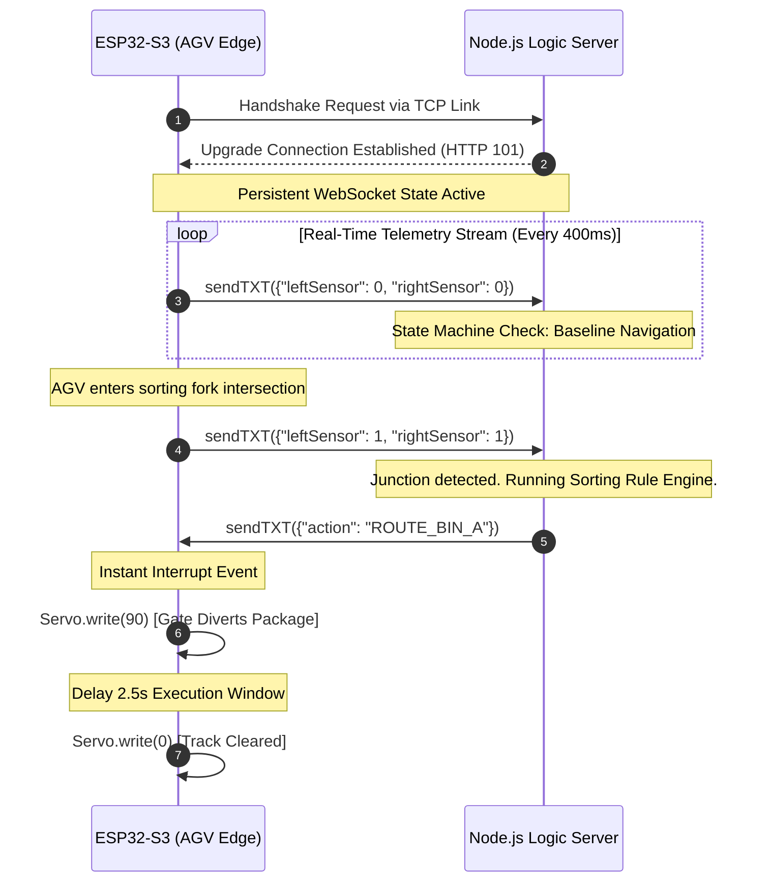

# SahlaSort Central Logic Engine (SCLE)

An asynchronous, event-driven, real-time industrial routing backend built to power autonomous package distribution networks and Automated Guided Vehicles (AGVs).

This repository houses the core scheduling and decision-making intelligence of the **SahlaSort** system. It utilizes low-latency, bidirectional persistent network pipelines to orchestrate real-time hardware telemetry ingestion and coordinate physical track mechanics with sub-millisecond dispatch cycles.

---

## 🏗️ System Architecture & Data Flow

Traditional IoT systems rely on standard HTTP polling mechanisms, which introduce significant latency overhead, waste edge-compute battery cycles, and increase the risk of collision at critical track junctions.

**SahlaSort** resolves this bottleneck by implementing a dedicated **WebSocket** topology. This establishes an open, persistent state-machine sync line between the microcontrollers on the warehouse floor and the central Node.js control runtime.

```mermaid
graph TD
    subgraph WF["Warehouse Floor (Edge Simulation)"]
        A[ESP32-S3 Core] -->|Pin 4/5: Continuous IR Telemetry JSON| B(WebSocket Connection)
        G[Mechanical Servo Gate] <--|Pin 18: Angle Commands 0°/90°| B
    end

    subgraph LH["Local LAN Hub"]
        B <-->|ws://192.168.1.70:8080| C[Central Node.js Engine]
    end

    subgraph LC["Logic Core"]
        C --> D{Junction Analytics}
        D -->|No Split Detected| E[Action: FOLLOW_LINE]
        D -->|Mismatched Junction 1,1| F[Action: ROUTE_BIN_A]
    end

    F -->|Instant Frame Push| C
```

### Protocol Sequence Diagram

The sequence below illustrates the asynchronous non-blocking telemetry stream and reactive actuation loops handled across the platform:



## 🛠️ Core Technology Stack

- **Runtime Environment:** Node.js (V8 Engine optimized for asynchronous operations)
- **Application Framework:** Express.js (Management Dashboard routing infrastructure)
- **Communication Protocol:** Native `ws` engine (RFC 6455 persistent duplex WebSocket server)
- **Edge Hardware Simulation Target:** ESP32-S3 Microcontroller running standard Xtensa-compiled C++ network stacks

## ⚙️ Repository File Structure

```
sahlasort-backend/
├── server.js            # Central Engine: orchestrates WebSocket connections & sorting rules
├── package.json         # Project manifests, script maps, and dependencies
└── README.md            # System operational blueprint and technical architecture guide
```

## 🚀 Deployment & Local Reproducibility

### 1. Prerequisites

Ensure you have Node.js (v18+) installed on your machine.

### 2. Installation

Clone this repository and install the dependencies:

```bash
git clone https://github.com/YOUR_GITHUB_USERNAME/sahlasort-backend.git
cd sahlasort-backend
npm install
```

### 3. Execution

Launch the central logic core engine:

```bash
node server.js
```

The terminal will spin up and display the active structural checkpoints:

```
📡 WebSocket Server running on ws://localhost:8080
🏭 Management Dashboard API available on http://localhost:3000
```

### 4. Edge Node Pairing (Hardware Setup)

Configure your edge microcontroller nodes to pair with your running host instance. Locate your local machine's IPv4 address (`ipconfig` / `ifconfig`) and bind the connection credentials inside your firmware:

```cpp
const char* ssid = "CirkitWifi";
const char* ws_host = "192.168.1.70"; // Target LAN IP Core
const int ws_port = 8080;
```
